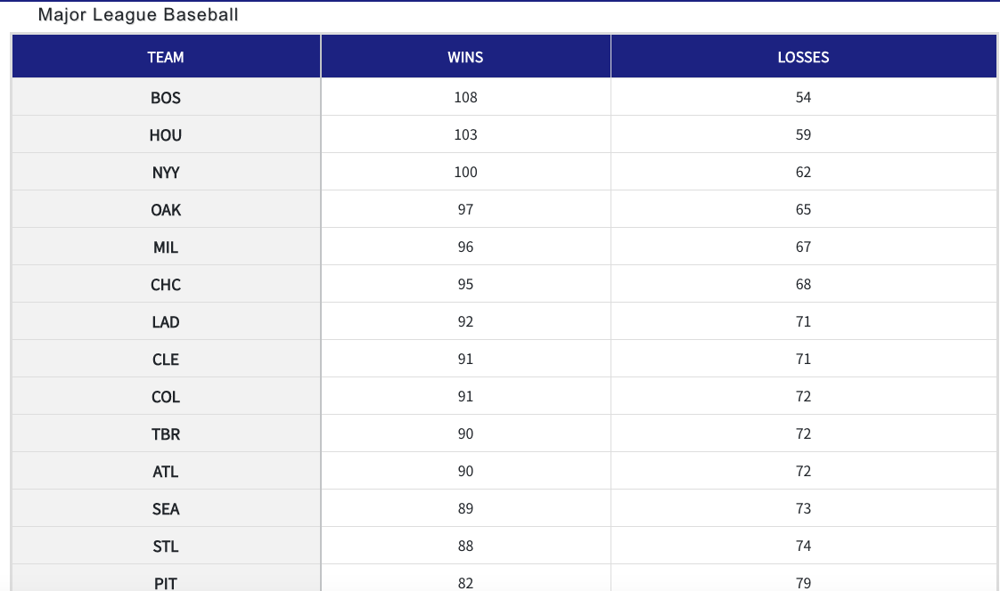
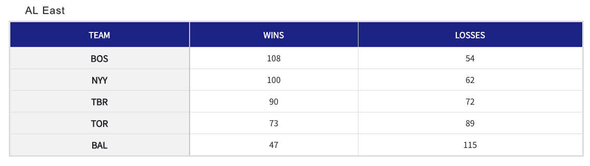
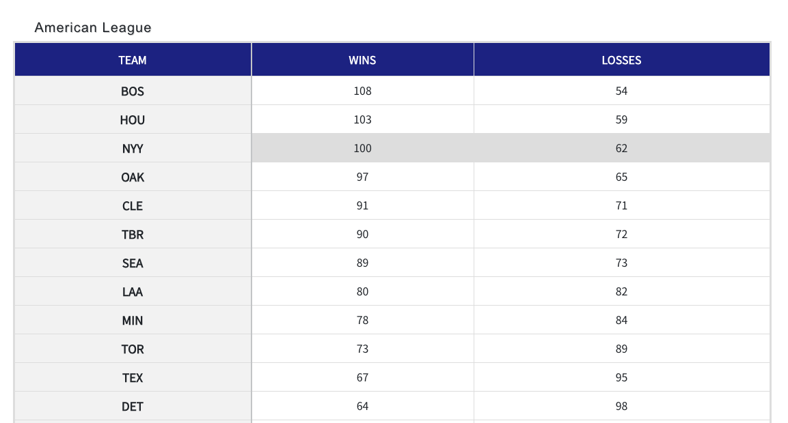

## BaseballResults

(https://baseball-results.herokuapp.com/)  
An application for users to see MLB team standings ranked by number of wins.
Users can filter the results 3 ways:

### 1. MLB
The "MLB" selection will display all
data ranked by wins.

### 2. Division

The "Division" selection will display teams ranked by wins
with the data filtered by division and by league.

### 3. League

 The "League" selection will
display data filtered by league only with the teams ranked by wins within each
league.by wins within each league.

   

## Getting Started

### Installing

This project uses bootstrap for styling. To install bootstrap:

### `npm install react-bootstrap bootstrap`

Then run:

### `npm start`

Runs the app in the development mode. 
Open [http://localhost:3000](http://localhost:3000) to view it in the browser.

Ran into an issue once or twice with babel not compiling properly. If this
error occurs, run:

### `npm i babel-preset-react-app@7.0.0`

### Built With
* React
* React-Bootstrap
- Bootstrap  

### Author
* Elizabeth Silver  

### License

This project is licensed under the MIT License - see the LICENSE.md file for
details  

### Acknowledgments
Thank you to MLB for providing the data for this app
